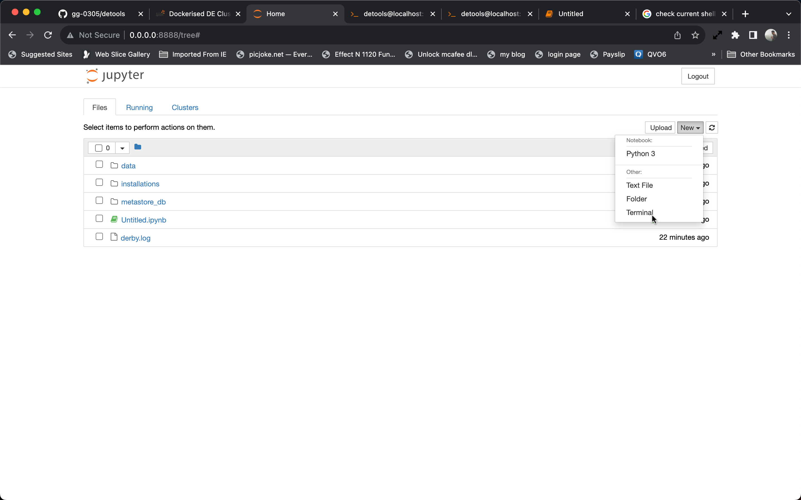

# Dockerized Local Big Data Cluster for Seamless Data Engineering

Are you a data engineer looking for a hassle-free way to set up a comprehensive Big Data cluster for your projects? Look no further! Welcome to our Git repository - a one-stop solution that provides a Dockerfile to effortlessly build a fully functional Hadoop, Spark, Hive, and Sqoop cluster.

**NOTE: Docker containers are shortlived, data stored on them will be lost as soon you stop the container.** 

# Quick Start:
1. Install [Docker Desktop](https://www.docker.com/products/docker-desktop/)
2. Pull _detools_ docker image: `docker pull giri7627/detools:latest`  
3. Start container: `docker run --rm -it -p 8080:8080 -p 9000:9000 -p 8088:8088 -p 8042:8042 -p 7077:7077 -p 8888:8888 --hostname localhost giri7627/detools:latest`  
4. Open Jupyter Notebook using the link displayed on terminal
5. Monitor Spark using [Yarn Application Master](http://localhost:8088)

# Initialize Spark:

```
import findspark
findspark.init()

from pyspark.sql import SparkSession

spark=SparkSession.builder.appName('Dockerised DE Cluster').getOrCreate()
```

# Access Terminal Using Jupyter Notebook

To Access Terminal using Jupyter notebook, open a terminal session by clicking on "New" button on Jupyter Home page.
 
 **execute `bash` command after the terminal opens**



